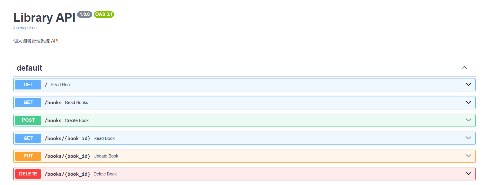

# 📚 LibriFlow - 個人圖書管理系統

一個基於 **FastAPI**、**Vue.js 3** 和 **PostgreSQL** 的全端圖書管理應用，使用 **Docker Compose** 進行容器化部署。


## 🌟 功能特色

- ✨ **現代化 UI** - 使用 Vue 3 Composition API 和 Tailwind CSS 打造美觀的響應式介面
- 📖 **完整的 CRUD 操作** - 新增、查看、更新和刪除書籍
- ⭐ **互動式評分系統** - 點擊星星直接為書籍評分，即時回饋
- 📊 **閱讀狀態追蹤** - 視覺化的狀態標籤（未讀、閱讀中、已完成）
- 📉 **空狀態處理** - 美觀的引導式空狀態介面
- 📈 **統計資訊** - 即時顯示書籍總數、閱讀中和已完成數量
- 🐳 **Docker 部署** - 一鍵啟動所有服務
- 🔄 **RESTful API** - 完整的後端 API，自動生成 Swagger 文件

## 🏗️ 技術架構

### 後端 (Backend)
- **框架**: FastAPI (Python 3.12+)
- **ORM**: SQLAlchemy
- **資料驗證**: Pydantic
- **資料庫**: PostgreSQL 15
- **API 文件**: Swagger UI (自動生成)

### 前端 (Frontend)
- **框架**: Vue.js 3 (Composition API)
- **構建工具**: Vite
- **樣式**: Tailwind CSS
- **HTTP 客戶端**: Axios

### 部署 (Deployment)
- **容器化**: Docker & Docker Compose
- **網路**: Docker Bridge Network
- **資料持久化**: Docker Volumes

## 📁 專案結構

```
libray_implement/
├── backend/                 # FastAPI 後端
│   ├── main.py             # 應用主入口與路由
│   ├── models.py           # SQLAlchemy 資料庫模型
│   ├── schemas.py          # Pydantic 資料驗證模型
│   ├── database.py         # 資料庫連線配置
│   ├── crud.py             # CRUD 操作邏輯
│   ├── requirements.txt    # Python 依賴套件
│   └── Dockerfile          # 後端容器映像檔
├── frontend/               # Vue.js 前端
│   ├── src/
│   │   ├── components/     # Vue 組件
│   │   │   ├── BookForm.vue    # 新增書籍表單（摺疊式面板）
│   │   │   └── BookList.vue    # 書籍清單展示
│   │   ├── App.vue         # 主頁面
│   │   ├── main.js         # 應用入口
│   │   └── style.css       # Tailwind CSS 樣式
│   ├── package.json        # npm 依賴配置
│   ├── vite.config.js      # Vite 配置
│   └── Dockerfile          # 前端容器映像檔
├── envs/                   # 環境變數配置
│   ├── .env                # 環境變數設定檔
│   └── .env.example        # 環境變數範例檔
├── imgs/                   # 專案截圖
├── docker-compose.yml      # 多容器編排定義
└── README.md              # 專案說明文件
```

## 🚀 快速開始

### 前置需求

- Docker
- Docker Compose

### 安裝步驟

1. **克隆專案**
```bash
git clone https://github.com/tzuhsiang/libray_implement.git
cd libray_implement
```

2. **配置環境變數**
```bash
cp envs/.env.example envs/.env
# 根據需要修改 envs/.env 中的配置
```

3. **啟動所有服務**
```bash
docker compose up --build
```

### 訪問應用

啟動成功後，可以訪問：

- 🌐 **前端界面**: http://localhost:5173
- 🔧 **後端 API**: http://localhost:8000
- 📚 **API 文件**: http://localhost:8000/docs



## 📊 資料庫 Schema

**books 表**

| 欄位名 | 類型 | 約束 | 說明 |
|--------|------|------|------|
| id | Integer | Primary Key, Autoincrement | 書籍 ID |
| title | String | Not Null | 書名 |
| author | String | Not Null | 作者 |
| status | String | Default: 'unread' | 閱讀狀態 (unread/reading/finished) |
| rating | Integer | Default: 0, Min: 0, Max: 5 | 評分 |

## 🔌 API 端點

| 方法 | 路徑 | 說明 |
|------|------|------|
| GET | `/books` | 取得所有書籍清單 |
| GET | `/books/{id}` | 取得單一書籍 |
| POST | `/books` | 新增書籍 |
| PUT | `/books/{id}` | 更新書籍資訊 |
| DELETE | `/books/{id}` | 刪除書籍 |
| GET | `/docs` | Swagger UI 文件 |

## 🎨 UI 功能

### 新增書籍 (優化)
- **摺疊式面板設計**，保持介面整潔
- 點擊展開輸入表單，新增或取消後自動收合
- 完整欄位支援：書名、作者、狀態、評分

### 書籍清單 (優化)
- **卡片式展示**：美觀的陰影與圓角設計
- **互動式評分**：滑鼠懸停預覽星星，點擊即時更新
- **視覺化狀態標籤**：
  - 📕 未讀 (灰色背景)
  - 📖 閱讀中 (藍色背景)
  - ✅ 已完成 (綠色背景)
- **空狀態引導**：當無書籍時顯示友善的提示圖示
- **即時響應**：操作後無需重整頁面
- **一鍵刪除**：支援確認對話框防止誤刪

### 統計儀表板
- 總書籍數
- 閱讀中書籍數
- 已完成書籍數

## 🛠️ 開發

### 停止服務
```bash
docker compose down
```

### 查看日誌
```bash
docker compose logs -f
```

### 僅重建特定服務
```bash
docker compose up --build backend
docker compose up --build frontend
```

## 🌐 Proxy 設定

如果您的網路環境需要使用 proxy，已在 `envs/.env` 中配置：

```env
HTTP_PROXY=http://{proxy_ip:port}
HTTPS_PROXY=https://{proxy_ip:port}
NO_PROXY=localhost,127.0.0.1,db,backend,frontend
```

## 📝 授權

MIT License

## 👨‍💻 作者

tzuhsiang

## 🙏 致謝

- FastAPI - 現代化 Python Web 框架
- Vue.js - 漸進式 JavaScript 框架
- Tailwind CSS - 實用優先的 CSS 框架
- PostgreSQL - 強大的開源關聯式資料庫
