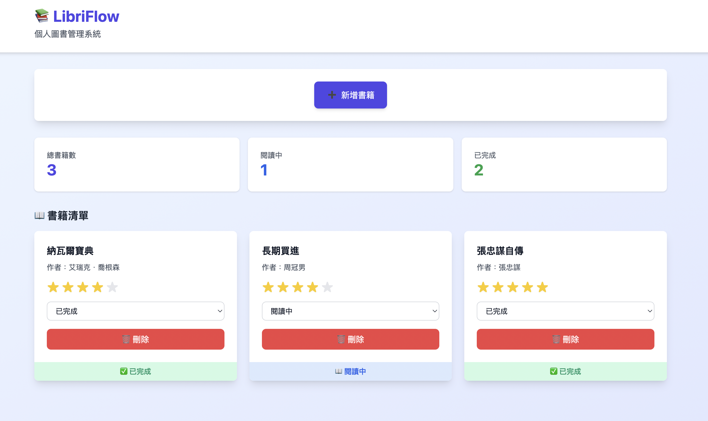
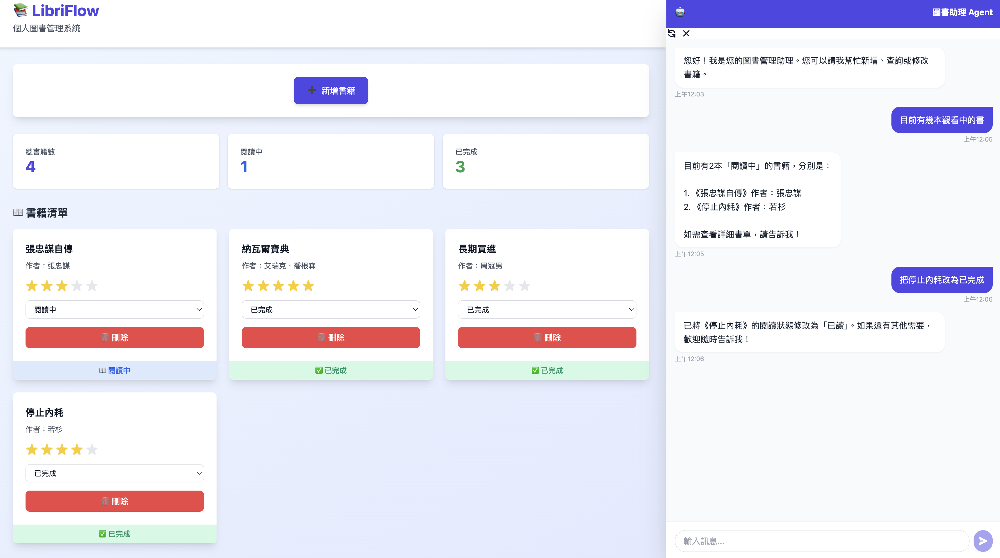

# 📚 LibriFlow - 個人圖書管理系統

一個基於 **FastAPI**、**Vue.js 3** 和 **PostgreSQL** 的全端圖書管理應用，整合 **AI Agent** 與 **MCP (Model Context Protocol)** 技術，提供智能化的語音/文字互動管理功能。



## 🌟 功能特色

- ✨ **現代化 UI** - 使用 Vue 3 Composition API 和 Tailwind CSS 打造美觀的響應式介面
- 🤖 **AI 智慧助理** - 內建交談式 Agent，可透過自然語言進行書籍管理操作
- 📖 **完整的 CRUD 操作** - 新增、查看、更新和刪除書籍
- ⭐ **互動式評分系統** - 點擊星星直接為書籍評分，即時回饋
- 📊 **閱讀狀態追蹤** - 視覺化的狀態標籤（未讀、閱讀中、已完成）
- 📉 **空狀態處理** - 美觀的引導式空狀態介面
- 📈 **統計資訊** - 即時顯示書籍總數、閱讀中和已完成數量
- 🐳 **Docker 部署** - 一鍵啟動所有服務
- 🔄 **RESTful API** - 完整的後端 API，自動生成 Swagger 文件

## 🤖 AI 讀書助理

本專案整合了基於 **Pydantic AI** 與 **MCP Server** 的智能助理，使用者可以透過右下角的對話視窗與 Agent 互動。



### 支援功能
- **新增書籍**：「幫我新增一本《原子習慣》，作者是詹姆斯·克利爾」
- **查詢書籍**：「列出我目前正在閱讀的書」
- **修改狀態**：「把《原子習慣》標記為已讀完」
- **修改評分**：「給《哈利波特》打 5 顆星」
- **自動同步**：Agent 操作完成後，畫面會自動更新顯示最新資料

## 🏗️ 技術架構

### 後端 (Backend)
- **框架**: FastAPI (Python 3.12+)
- **AI Agent**: Pydantic AI
- **工具協定**: Model Context Protocol (MCP) by Anthropic
- **LLM**: Azure OpenAI (GPT-4o)
- **ORM**: SQLAlchemy
- **資料驗證**: Pydantic
- **資料庫**: PostgreSQL 15

### 前端 (Frontend)
- **框架**: Vue.js 3 (Composition API)
- **構建工具**: Vite
- **樣式**: Tailwind CSS
- **HTTP 客戶端**: Axios

### 部署 (Deployment)
- **容器化**: Docker & Docker Compose

## 📁 專案結構

```
libray_implement/
├── backend/                 # FastAPI 後端 & AI Agent
│   ├── main.py             # 應用主入口與路由 (含 Chat Endpoint)
│   ├── agent.py            # Pydantic AI Agent 定義
│   ├── mcp_server.py       # MCP Server 工具實作
│   ├── models.py           # SQLAlchemy 資料庫模型
│   ├── schemas.py          # Pydantic 資料驗證模型
│   ├── database.py         # 資料庫連線配置
│   ├── crud.py             # CRUD 操作邏輯
│   ├── requirements.txt    # Python 依賴套件
│   └── Dockerfile          # 後端容器映像檔
├── frontend/               # Vue.js 前端
│   ├── src/
│   │   ├── components/     # Vue 組件
│   │   │   ├── ChatWindow.vue  # AI 對話視窗組件
│   │   │   ├── BookForm.vue    # 新增書籍表單
│   │   │   └── BookList.vue    # 書籍清單展示
│   │   ├── App.vue         # 主頁面
│   │   └── ...
│   └── Dockerfile          # 前端容器映像檔
├── envs/                   # 環境變數配置
│   ├── .env                # 環境變數設定檔 (含 Azure OpenAI Key)
│   └── .env.example        # 環境變數範例檔
├── docker-compose.yml      # 多容器編排定義
└── README.md              # 專案說明文件
```

## 🚀 快速開始

### 前置需求

- Docker
- Docker Compose

### 安裝步驟

1. **克隆專案**
```bash
git clone https://github.com/tzuhsiang/libray_implement.git
cd libray_implement
```

2. **配置環境變數**
```bash
cp envs/.env.example envs/.env
```
**重要**：請編輯 `envs/.env`，填入您的 **Azure OpenAI** 相關金鑰，以啟用 AI 功能：
```env
AZURE_OPENAI_API_KEY=your_key
AZURE_OPENAI_ENDPOINT=your_endpoint
AZURE_OPENAI_API_VERSION=2024-02-15-preview
AZURE_DEPLOYMENT_NAME=gpt-4o
```

3. **啟動所有服務**
```bash
docker compose up --build
```

### 訪問應用

- 🌐 **前端界面**: http://localhost:5173
- 🔧 **後端 API**: http://localhost:8000
- 📚 **API 文件**: http://localhost:8000/docs

## 📊 資料庫 Schema

| 欄位名 | 類型 | 說明 |
|--------|------|------|
| id | Integer | Primary Key |
| title | String | 書名 |
| author | String | 作者 |
| status | String | unread / reading / finished |
| rating | Integer | 0-5 |

## 🔌 API 端點

包含標準 RESTful API 與 Chat API：

| 方法 | 路徑 | 說明 |
|------|------|------|
| POST | `/chat` | 與 AI Agent 對話 |
| GET | `/books` | 取得書籍清單 |
| POST | `/books` | 新增書籍 |
| ... | ... | ... |

## 🛠️ 開發與除錯

- 查看後端日誌 (包含 Agent 思考過程)：
```bash
docker compose logs -f backend
```

## 授權

MIT License

## 作者

tzuhsiang

## 致謝

- Pydantic AI
- Model Context Protocol (MCP)
- FastAPI, Vue.js, PostgreSQL
