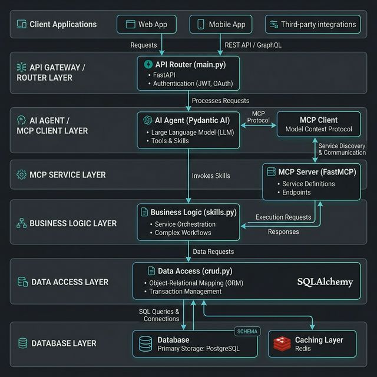

# 📚 LibriFlow 軟體架構說明文件

本文件詳細描述了 LibriFlow 後端系統的內部模組化設計、元件職責以及互動流程。

---

## 軟體架構圖 (Software Architecture)

### 軟體模組功能說明：

1.  **`main.py` (Router)**: 
    - 定義 FastAPI 應用程式實例。
    - 提供 RESTful API 端點（如 `/books`）供前端直接存取書籍數據。
    - 提供 `/chat` 端點，作為與 AI Agent 對話的 SSE (Server-Sent Events) 串流接口。

2.  **`agent.py` (AI Core)**: 
    - 使用 **Pydantic AI** 建構智慧 Agent。
    - 定義系統提示語 (System Prompt)，導引 LLM 成為圖書助理。
    - 實作 MCP Client 邏輯，建立與工具伺服器間的對話 Session。

3.  **`mcp_server.py` (Tool Layer)**: 
    - 基於 **FastMCP** 協議實作。
    - 將底層業務邏輯封裝為 LLM 可理解的「工具」(Tools)，如 `add_book`、`delete_book`。

4.  **`skills.py` (Business Logic)**: 
    - 具體的圖書管理業務邏輯實作。
    - 處理資料格式驗證與複合邏輯運算，確保工具執行層與資料庫層解耦。

5.  **`crud.py` & `models.py` (Data Access)**: 
    - 使用 SQLAlchemy 定義書籍模型表結構。
    - 實作資料庫的增刪查改操作，封裝 SQL 互動細節。

---

## 重要互動流程 - 智慧對話 (Chat Flow)

1.  **接收訊息**：`main.py` 接收到前端發送的對話請求。
2.  **啟動 Agent**：`agent.py` 將訊息發送給 Azure OpenAI，並根據 LLM 的回覆決定下一步。
3.  **工具決策**：若 LLM 判斷需要操作數據，Agent 會觸發定義好的內部工具函數。
4.  **執行協議**：內部工具函數透過 `ClientSession` 呼叫遠端的 `mcp_server.py` 工具實體。
5.  **數據異動**：`mcp_server.py` 調用 `skills.py` 與 `crud.py` 更新資料庫。
6.  **串流回覆**：Agent 取得執行結果後，組織成繁體中文回應，並經由 SSE 逐字串流回前端顯示。
