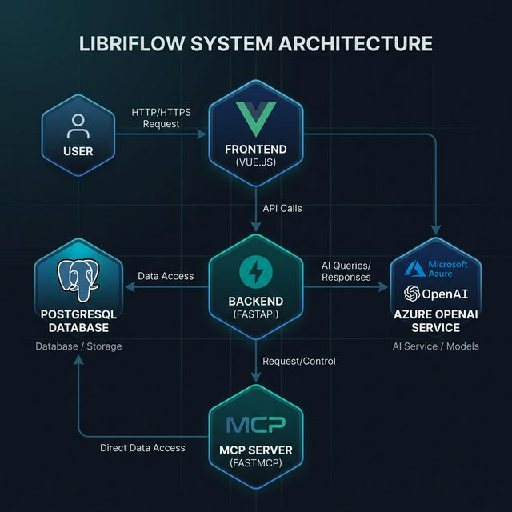

# 📚 LibriFlow 系統架構說明文件

本文件詳細描述了 LibriFlow 個人圖書管理系統的整體系統架構與容器化部署設計。

---

## 系統架構圖 (System Architecture)

### 系統組件說明：
*   **前端 (Frontend)**: 基於 Vue.js 3 構建，負責展示圖書列表、管理界面以及 AI 對話視窗。運行於 5173 端口。
*   **後端 (Backend)**: 基於 FastAPI，作為系統的核心入口。它負責業務邏輯處理，並充當 **MCP Client** 交織於 Agent 與工具伺服器之間。運行於 8000 端口。
*   **MCP Server**: 獨立運行的 FastMCP 服務，封裝了對資料庫讀寫的「工具」(Tools)，如 `add_book`、`list_books`。運行於 8001 端口。
*   **PostgreSQL**: 持久化儲存書籍數據、評分與狀態。
*   **Azure OpenAI**: 外部服務，提供語言模型能力（如 GPT-4o），協助 Agent 執行決策與工具呼叫。
